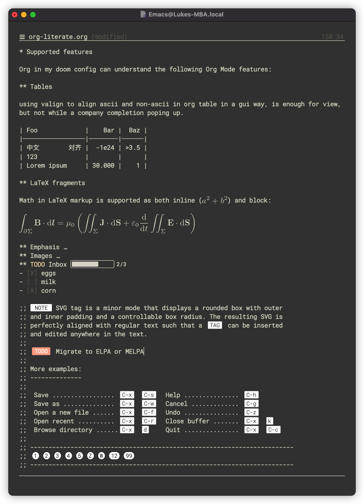
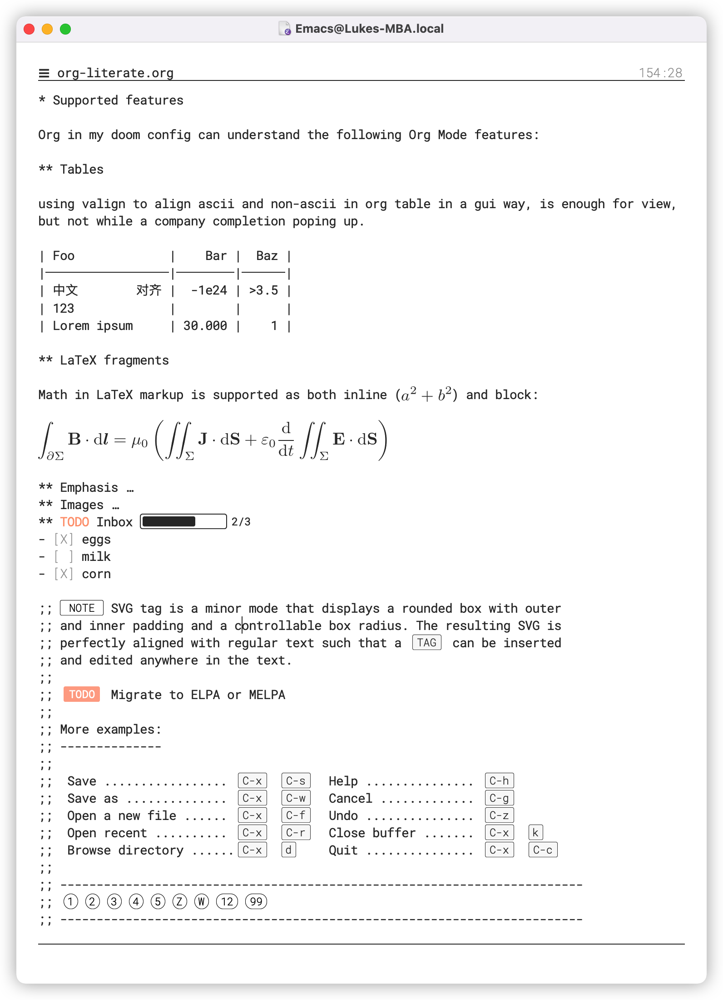

### Basic config for org mode in emacs

### Inspiration

- [valign](https://github.com/casouri/valign)
- [org-appear](https://github.com/awth13/org-appear)
- [org-fragtog](https://github.com/io12/org-fragtog)
- [svg-lib](https://github.com/rougier/svg-lib)
- [svg-tag](https://github.com/rougier/svg-tag-mode)
- [elegant-emacs](https://github.com/rougier/elegant-emacs)
- [org-inline-images](./lisp/org-inline-image.el)
- [emacs-svg-icons](https://github.com/rougier/emacs-svg-icon)

### TODO

- [ ] complete each component as minor mode
- [ ] build a callout mode as minor to org mode
- [ ] parse gif image temp in storage not memory 
- [ ] add evil mode to help emacs more modal

### Other Tools to help reading

- [orgro](https://github.com/luk3ya0/orgro)
