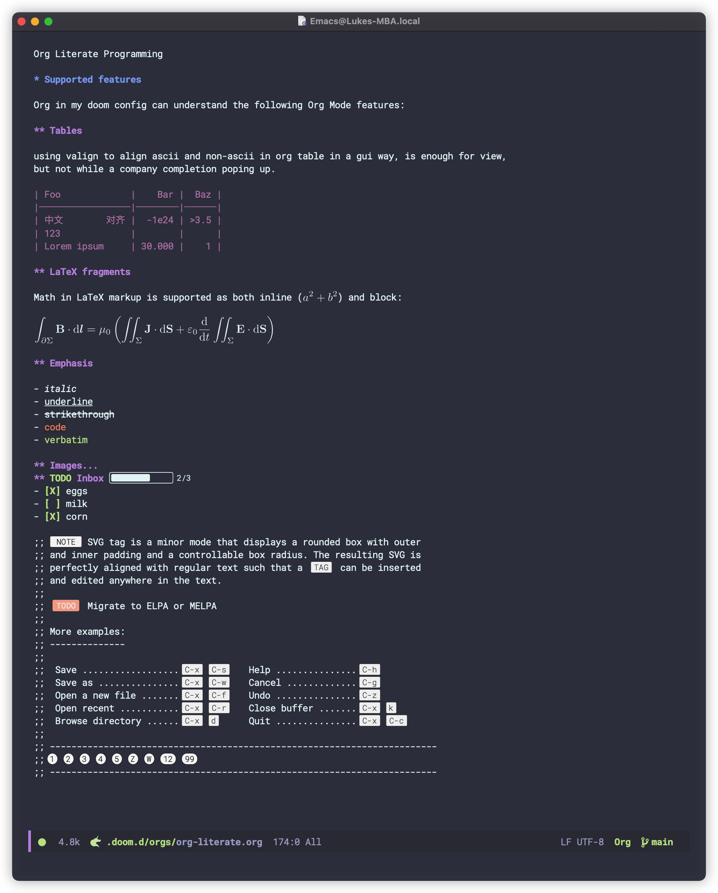
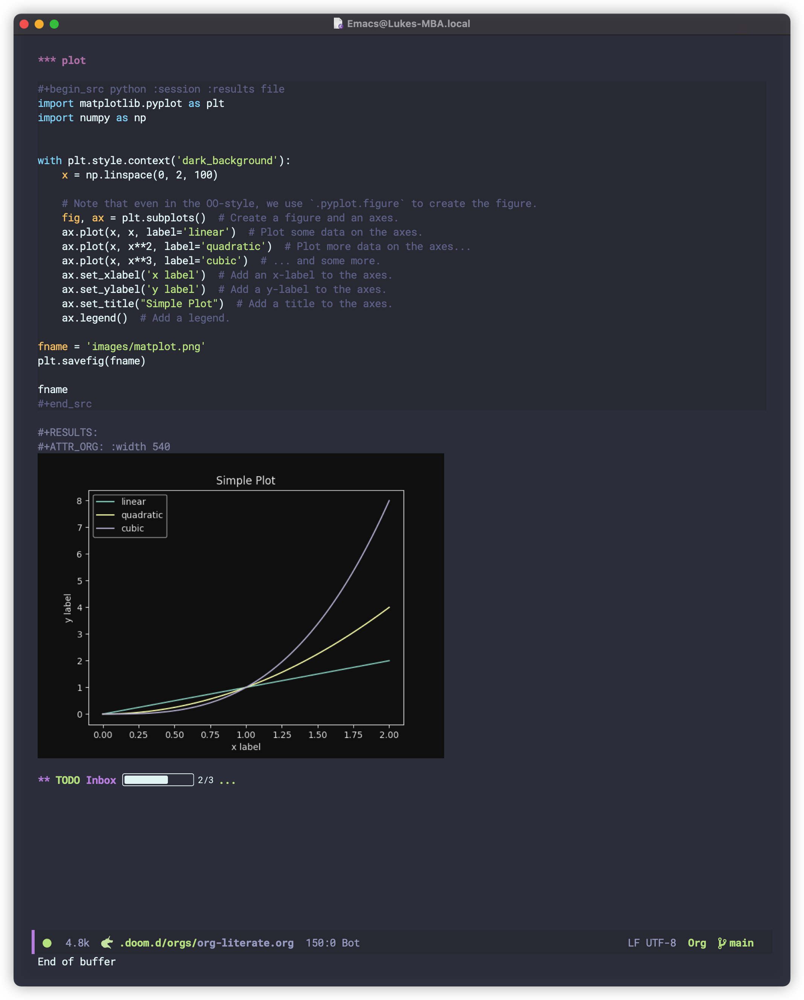

# Some config for doom-emacs

get doom-emacs battery-included with org-enchance and faster at startup with 0.6-0.7s

### LSP config

uncomment the following for programming in `init.el`

```lisp
emacs-lisp                   ; drown in parentheses
(go +lsp)                    ; the hipster dialect
(java +lsp)                  ; the poster child for carpal tunnel syndrome
lua                          ; one-based indices? one-based indices
(python +lsp +pyright)       ; beautiful is better than ugly
rust                         ; Fe2O3.unwrap().unwrap().unwrap().unwrap()
sh                           ; she sells {ba,z,fi}sh shells on the C xor
```

config for java and python in `config.el`

```lisp
;; lsp and prog mode
(use-package! lsp-mode
  :hook
  ((python-mode . (lambda () (lsp-register-custom-settings
                            '(("python.pythonPath" "/opt/miniforge3/bin/python3"
                               "python.venvPath" "/opt/miniforge3"))))))
)

(add-hook! python-mode
  (setq python-shell-interpreter "/opt/miniforge3/bin/bpython"))

(use-package! dap-mode
  :ensure t
  :after (lsp-mode)
  :functions dap-hydra/nil
  :config
  (require 'dap-java)
  :hook ((dap-mode . dap-ui-mode)
    (dap-session-created . (lambda (&_rest) (dap-hydra)))
    (dap-terminated . (lambda (&_rest) (dap-hydra/nil)))))

(use-package! dap-java :ensure nil)

(use-package! lsp-java
  :ensure t
  :init
  (setenv "JAVA_HOME"  "/Library/Java/JavaVirtualMachines/zulu-11.jdk/Contents/Home")
  (setq lsp-java-java-path "/Library/Java/JavaVirtualMachines/zulu-11.jdk/Contents/Home/bin/java")
  :config (add-hook 'java-mode-hook 'lsp))

(use-package! lsp-ui
  :commands lsp-ui-mode
  :config
  (setq lsp-headerline-breadcrumb-enable t
        lsp-lens-enable t
        )
  )

(defun py-compile ()
  "Use compile to run python programs"
  (interactive)
  (compile (concat "python3 " (buffer-name))))
(setq compilation-scroll-output t)
```

The rest config focus on org mode and other productive tools.

### Basic config for org mode in emacs




### Inspiration

- [valign](https://github.com/casouri/valign)
- [org-appear](https://github.com/awth13/org-appear)
- [org-fragtog](https://github.com/io12/org-fragtog)
- [svg-lib](https://github.com/rougier/svg-lib)
- [svg-tag](https://github.com/rougier/svg-tag-mode)
- [elegant-emacs](https://github.com/rougier/elegant-emacs)
- [org-inline-images](./lisp/org-inline-image.el)
- [emacs-svg-icons](https://github.com/rougier/emacs-svg-icon)

### TODO

- [ ] complete each component as minor mode
- [ ] build a callout mode as minor to org mode
- [ ] parse gif image temp in storage not memory 
- [ ] add evil mode to help emacs more modal

### Other Tools to help reading

- [orgro](https://github.com/luk3ya0/orgro)
