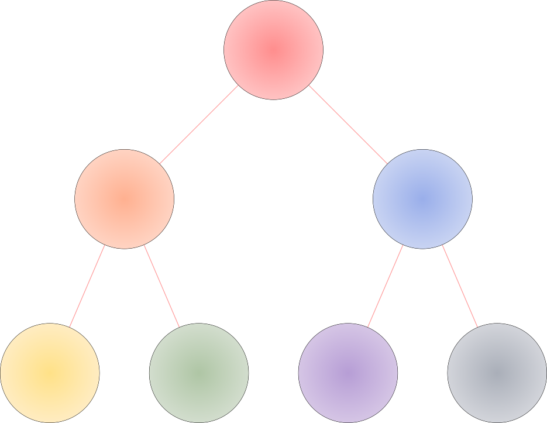

<p align="center">
  
  <small display="block">org mode latex babel svg output</small>
</p>

<p align="center">
  
  <small display="block">highlight sentence to focus reading</small>
</p>

## Prerequisite

``` shell
# install emacs-mac with some options
brew install emacs-mac --build-from-source --with-imagemagick --with-librsvg --with-no-title-bar

# install basictex other than huge mactex
brew install basictex font-firacode font-firamath

# install some critical packages of latex
sudo tlmgr install dvisvgm xelatex xcolor firamath unicode-math
```

## TODO

- [ ] Precise Lsp Server Texlab Configuration

- [ ] Flycheck Errors Ignore List

- [ ] AUC-Tex Command Recipes

- [ ] Checkout a -Q Develop Branch

## Some Resources

[An Introduction to Programming in Emacs Lisp](https://www.gnu.org/software/emacs/manual/html_node/eintr/index.html#Top)

[System Crafters - Youtube Channel](https://www.youtube.com/@SystemCrafters)

[DistroTube - Youtube Channel](https://www.youtube.com/@DistroTube)

[Xah Lee - Nice Collections to Learn Emacs Lisp](http://xahlee.info/emacs/emacs/elisp_basics.html)

## Problem

- [Tikz in Org Mode](https://ionizing.page/post/a-new-journey/)

- [CJK in Org Mode Latex](https://q3yi.me/post/4_use_xelatex_instead_of_latex_in_org_preview_latex_process/)

- [Beautify the Latex in Org Mode](https://emacs-china.org/t/org-mode-latex-mode/22490)

- [Align Baseline of Latex Fragment in Org Mode](https://emacs-china.org/t/org-latex-preview/22288)

- [Patch to align latex fragment for org mode](https://list.orgmode.org/874k9oxy48.fsf@gmail.com/#Z32lisp:org.el)

- [Fast ox-hugo setup](https://ox-hugo.scripter.co)

- [Anim GIF in Org Mode](https://github.com/shg/org-inline-anim.el)

- [Emacs: configuring mixed fonts in Org mode](https://protesilaos.com/codelog/2020-07-17-emacs-mixed-fonts-org/)

- [Symbols in Org-mode](https://orgmode.org/worg/org-symbols.html)

- [Emacs, fonts and fontsets](https://idiocy.org/emacs-fonts-and-fontsets.html)

- [Emacs Lisp Object Finalizers](https://nullprogram.com/blog/2014/01/27/)

## Awesome Configuration

<https://sachachua.com/dotemacs/index.html>

<https://ianyepan.github.io/posts/emacs-ide/>

## Org babel LaTeX

```{=org}
#+header: :headers '("\\usepackage{tikz}\n" "\\usepackage{xcolor}\n")
#+header: :results file graphics :file ./misc/radial-tree.svg
#+header: :exports results
#+begin_src latex
\begin{tikzpicture}
\draw[red] (7,8.5) -- (4,5.5);
\draw[red] (7,8.5) -- (10,5.5);

\draw[red] (4,5.5) -- (2.5,2);
\draw[red] (4,5.5) -- (5.5,2);

\draw[red] (10,5.5) -- (8.5,2);
\draw[red] (10,5.5) -- (11.5,2);

\definecolor{redI}{HTML}{FF8D8D}
\definecolor{redO}{HTML}{FFC2C2}
\filldraw[even odd rule,inner color=redI,outer color=redO] (7,8.5) circle (1);

\definecolor{orangeI}{HTML}{FFB090}
\definecolor{orangeO}{HTML}{FFD3C2}
\filldraw[even odd rule,inner color=orangeI,outer color=orangeO] (4,5.5) circle (1);

\definecolor{blueI}{HTML}{99AEEA}
\definecolor{blueO}{HTML}{C8D3F2}
\filldraw[even odd rule,inner color=blueI,outer color=blueO] (10,5.5) circle (1);

\definecolor{yellowI}{HTML}{FFE187}
\definecolor{yellowO}{HTML}{FFECC1}
\filldraw[even odd rule,inner color=yellowI,outer color=yellowO] (2.5,2) circle (1);

\definecolor{greenI}{HTML}{AEC5A4}
\definecolor{greenO}{HTML}{D2DDCD}
\filldraw[even odd rule,inner color=greenI,outer color=greenO] (5.5,2) circle (1);

\definecolor{purpleI}{HTML}{B69DD5}
\definecolor{purpleO}{HTML}{D5C5E5}
\filldraw[even odd rule,inner color=purpleI,outer color=purpleO] (8.5,2) circle (1);

\definecolor{grayI}{HTML}{A9AEB8}
\definecolor{grayO}{HTML}{D2D4DA}
\filldraw[even odd rule,inner color=grayI,outer color=grayO] (11.5,2) circle (1);
\end{tikzpicture}
```

